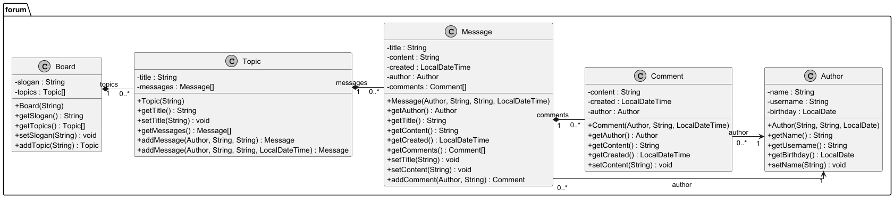

# Java Discussion Board

Ein einfaches Java-Projekt zum Üben von objektorientierter Programmierung (OOP).

## 📌 Beschreibung

Dieses Projekt stellt ein kleines Diskussionsforum dar.

Benutzer können:

- Themen erstellen
- Nachrichten schreiben
- Kommentare hinzufügen

## 🧱 Klassen

- **Board** – verwaltet alle Themen
- **Topic** – enthält Nachrichten
- **Message** – enthält Titel, Inhalt und Kommentare
- **Comment** – Kommentar zu einer Nachricht
- **Author** – Benutzer des Systems

## 💻 Verwendete Technologien

- Java
- OOP
- UML / PlantUML
- Git
- GitHub
- IntelliJ IDEA

## 📊 UML-Diagramm

## ▶️ Programm starten

Starte die Datei:

`Main.java`

## 🎯 Lernziele

Mit diesem Projekt wurden folgende Themen geübt:

- Klassen und Objekte
- Beziehungen zwischen Klassen
- Getter / Setter
- Konstruktoren
- Arrays
- Git & GitHub

## 👤 Autor

GitHub: [@danyalde01](https://github.com/danyalde01)